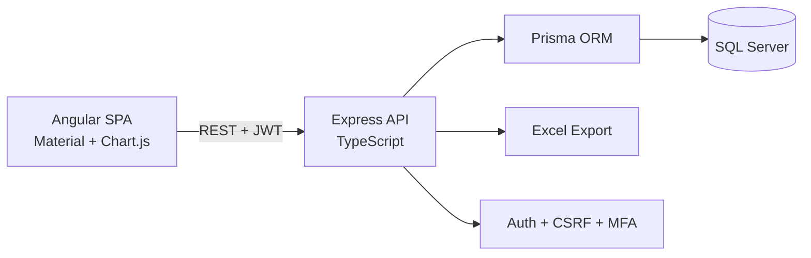

# Inventory Management System

A full-stack inventory management app rebuilt from a working Python CLI into a generalized production-style web application.

The original tool tracked biodegradable-bag stock in SQLite with terminal menus. This rebuild keeps the useful business workflows, then moves them into a layered app: Angular UI, Express + TypeScript API, Prisma, and SQL Server.

## What It Does

- Tracks items across configurable categories and units of measure.
- Records stock-in, sale, and adjustment transactions.
- Prevents overselling on sales.
- Supports backdated transaction entry for historical records.
- Preserves undo as an audit-friendly transaction void instead of deleting history.
- Shows current stock, low-stock status, recent activity, sales/profit, and stock velocity.
- Exports a multi-sheet Excel report for stock, transaction history, and sales/profit.
- Supports real user accounts with admin/staff roles, JWT sessions, refresh-token revocation, CSRF protection, and optional TOTP MFA.
- Migrates historical data from the legacy `inventory.db` SQLite file.

## Architecture



## Tech Stack

- Backend: Node.js, Express, TypeScript, Zod, Prisma
- Database: SQL Server
- Frontend: Angular, Angular Material, Chart.js
- Reports: ExcelJS
- Security: Helmet, CORS allow-list, JWT access/refresh tokens, bcrypt, CSRF, optional TOTP MFA
- Testing: Node test runner + Supertest, Angular/Vitest
- Deployment: Docker, docker-compose, GitHub Actions scaffold

## Local Setup

Start SQL Server:

```bash
docker compose up sqlserver
```

Create `backend/.env` from `backend/.env.example`, then run:

```bash
cd backend
npm install
npx prisma migrate deploy
npm run db:seed:demo
npm run dev
```

In a second terminal:

```bash
cd frontend
npm install
npm start
```

Open `http://localhost:4200`.

Demo accounts after seeding:

- Admin: `admin@example.com` / `AdminDemo!2026`
- Staff: `staff@example.com` / `StaffDemo!2026`

## Useful Commands

Backend:

```bash
cd backend
npm run build
npm test
npm run db:seed:demo
npm run migrate:legacy
npm run migrate:legacy -- --apply
```

Frontend:

```bash
cd frontend
npm run build
npm test -- --watch=false
```

Docker:

```bash
docker build -t inventory-management-system:local .
docker compose up --build
```

## Legacy Migration

The one-off migration script reads the old SQLite database at `inventory.db` and maps:

- `dimension` to a new item SKU/name
- `amount_kg` to transaction quantity
- `current_stock_kg` to resulting stock
- `cost_per_kg` and `sell_per_kg` to unit cost/price
- old free-text users to matching users or a historical import user

Dry run:

```bash
cd backend
npm run migrate:legacy
```

Apply:

```bash
npm run migrate:legacy -- --apply
```

## Current Phase Status

- Phase 1: project foundation complete.
- Phase 2: Prisma SQL Server model, migrations, and seed data complete.
- Phase 3: auth, users, categories, units, items, settings, validation, and central errors complete.
- Phase 4: transactions, undo, reports, velocity, and Excel export complete.
- Phase 5: Angular auth, guards, interceptor, and app shell complete.
- Phase 6: inventory, item detail, item form, transaction form/list, undo, and CSV import complete.
- Phase 7: dashboard, reports, velocity, and Excel download complete.
- Phase 8: legacy SQLite migration script complete.
- Phase 9: local hardening and tests added; remaining production decisions are listed below.
- Phase 10: Docker and CI scaffold complete; Azure resources still need account-specific setup.
- Phase 11: README/project story updated; portfolio entry and live screenshots still depend on deployment.

## Known Follow-Ups

- Set real production secrets through Azure App Service settings or Key Vault.
- Create Azure SQL Database and Azure App Service resources, then wire the GitHub Actions deploy step to your subscription.
- Replace the placeholder CI deploy section with your actual Azure publish profile or federated identity setup.
- Address the remaining moderate `exceljs -> uuid` advisory when ExcelJS publishes a non-breaking fix.
- Tune the Angular bundle budget or split more code if the initial budget warning matters for CI.
- Add screenshots or a short GIF after the app is deployed.

## Project Story

This project started as a useful single-file Python CLI with real inventory workflows, but it was tightly coupled to one business and mixed terminal presentation with database writes in the same functions. The rebuild generalizes the data model, adds a browser UI, introduces real authentication and security controls, preserves legacy data through migration, and packages the app for deployment on Azure.
