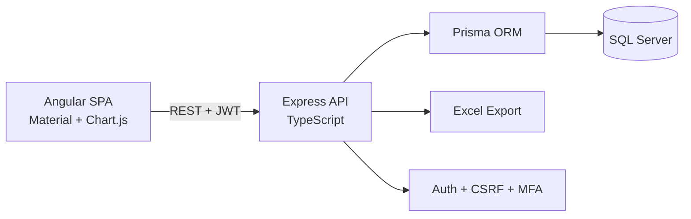

# Inventory Management System

A full-stack inventory management app rebuilt from a working Python CLI into a generalized production-style web application.

The original tool tracked biodegradable-bag stock in SQLite with terminal menus. This rebuild keeps the useful business workflows, then moves them into a layered app: Angular UI, Express + TypeScript API, Prisma, and SQL Server.

## What It Does

- Tracks items across configurable categories and units of measure.
- Records stock-in, sale, and adjustment transactions.
- Prevents overselling on sales.
- Supports backdated transaction entry for historical records.
- Preserves undo as an audit-friendly transaction void instead of deleting history.
- Shows current stock, low-stock status, recent activity, sales/profit, and stock velocity.
- Exports a multi-sheet Excel report for stock, transaction history, and sales/profit.
- Supports real user accounts with admin/staff roles, JWT sessions, refresh-token revocation, CSRF protection, and optional TOTP MFA.
- Migrates historical data from the legacy `inventory.db` SQLite file.

## Architecture



## Tech Stack

- Backend: Node.js, Express, TypeScript, Zod, Prisma
- Database: SQL Server
- Frontend: Angular, Angular Material, Chart.js
- Reports: ExcelJS
- Security: Helmet, CORS allow-list, JWT access/refresh tokens, bcrypt, CSRF, optional TOTP MFA
- Testing: Node test runner + Supertest, Angular/Vitest
- Deployment: Docker, docker-compose, GitHub Actions scaffold

## Local Setup

Start SQL Server:

```bash
docker compose up sqlserver
```

Create `backend/.env` from `backend/.env.example`, then run:

```bash
cd backend
npm install
npx prisma migrate deploy
npm run db:seed:demo
npm run dev
```

In a second terminal:

```bash
cd frontend
npm install
npm start
```

Open `http://localhost:4200`.

Demo accounts after seeding:

- Admin: `admin@example.com` / `AdminDemo!2026`
- Staff: `staff@example.com` / `StaffDemo!2026`

## Useful Commands

Backend:

```bash
cd backend
npm run build
npm test
npm run db:seed:demo
npm run migrate:legacy
npm run migrate:legacy -- --apply
```

Frontend:

```bash
cd frontend
npm run build
npm test -- --watch=false
```

Docker:

```bash
docker build -t inventory-management-system:local .
docker compose up --build
```

## Legacy Migration

The one-off migration script reads the old SQLite database at `inventory.db` and maps:

- `dimension` to a new item SKU/name
- `amount_kg` to transaction quantity
- `current_stock_kg` to resulting stock
- `cost_per_kg` and `sell_per_kg` to unit cost/price
- old free-text users to matching users or a historical import user

Dry run:

```bash
cd backend
npm run migrate:legacy
```

Apply:

```bash
npm run migrate:legacy -- --apply
```

## Deployment

The image serves the API and the built Angular app from one origin, so a single
App Service container runs the whole thing. In production the frontend talks to
`/api` on its own origin (`src/environments/environment.prod.ts`); only the dev
server points at `localhost:3000`.

The `deploy` job in `.github/workflows/ci.yml` runs on pushes to `main`. It
builds and pushes the image, applies `prisma migrate deploy`, optionally reseeds
demo data, deploys to App Service, and polls `/api/health` until the new
revision answers. It skips itself with a notice when the Azure secrets are
absent, so a fork without an Azure account still gets a green pipeline.

One-time setup — create an Azure SQL Database (free offer) and an App Service
(F1), then set these repository secrets:

| Secret | Purpose |
|---|---|
| `AZURE_CREDENTIALS` | Service principal JSON for `azure/login` |
| `AZURE_WEBAPP_NAME` | Target App Service name |
| `AZURE_WEBAPP_URL` | Base URL, used by the post-deploy smoke test |
| `REGISTRY_LOGIN_SERVER` / `REGISTRY_USERNAME` / `REGISTRY_PASSWORD` | Container registry |
| `DATABASE_URL` | Azure SQL connection string used for migrations |

Set repository variable `SEED_DEMO_ON_DEPLOY=true` to reset the public demo
dataset on each deploy. Application secrets (`JWT_ACCESS_SECRET`,
`JWT_REFRESH_SECRET`, `JWT_MFA_SECRET`, `DATABASE_URL`) belong in App Service
Application Settings or Key Vault — the app refuses to boot in production if a
signing secret is missing or still set to the shipped development default.

## Current Phase Status

Verified against a running SQL Server, a live API, and the app in a browser —
not just "the code exists".

| Phase | State | How it was checked |
|---|---|---|
| 1 — Foundation | Complete | Both dev servers boot; `/api/health` returns 200 |
| 2 — Data model | Complete | 4 migrations applied; seed creates non-bag categories, 4 units, 5 items |
| 3 — Auth & CRUD | Complete | Login, RBAC 403s, CSRF 403, soft delete, page-size cap, token revocation |
| 4 — Transactions & reports | Complete | Oversell rejected, undo reverses stock, 3-sheet Excel export opens |
| 5 — Frontend auth | Complete | Login → dashboard in browser; guards redirect; MFA challenge step |
| 6 — Inventory & transactions UI | Complete | Item CRUD, stepper, bulk entry, CSV import, undo toasts |
| 7 — Reports & dashboard | Complete | Stock chart renders; date presets; Excel download |
| 8 — Legacy migration | Complete | Dry run against the real `inventory.db` reports 2/2 rows ready |
| 9 — Security & testing | Complete | 18 backend + 6 frontend tests; headers, rate limits, revocation verified |
| 10 — Docker & CI/CD | Code complete | Image builds; deploy job added — needs an Azure subscription to run |
| 11 — Polish | Code complete | README current; screenshots and portfolio entry await a live URL |

## Known Follow-Ups

- Create the Azure SQL Database and App Service, then add the secrets in the table above.
- Add screenshots or a short GIF, and the portfolio entry, once the demo URL is live.
- Account lockout state is in-process; move it to a shared store if the app is ever scaled past one instance.
- `exceljs -> uuid` carries a moderate advisory with no non-breaking fix published yet; CI fails only on high/critical.

## Project Story

This project started as a useful single-file Python CLI with real inventory workflows, but it was tightly coupled to one business and mixed terminal presentation with database writes in the same functions. The rebuild generalizes the data model, adds a browser UI, introduces real authentication and security controls, preserves legacy data through migration, and packages the app for deployment on Azure.
